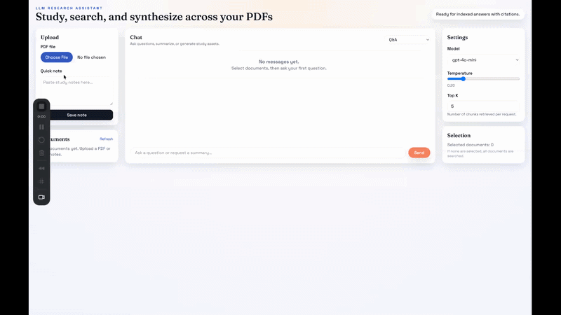

# LLM-Powered Study & Research Assistant



Upload PDFs and notes, then get citation-backed answers, summaries, key takeaways,
and flashcards powered by RAG (Retrieval-Augmented Generation). Built with a
FastAPI backend, FAISS vector search, and a React + Vite frontend.


> **Live Demo:** [llm-study-assistant.vercel.app](https://llm-study-assistant.vercel.app)

## Features
- Upload PDFs or text notes
- Chunking (~800 tokens with 120 overlap), embeddings, and local FAISS vector search
- SQLite metadata store for documents and chunk provenance
- Citation-backed answers with document title, page number, chunk id, and snippet
- Modes: Q&A, summarize doc, summarize multi-doc, key takeaways, flashcards
- React UI with uploads, document list, chat, citations, and settings
- Docker Compose for local setup

## Architecture
```
frontend/            React + Vite + Tailwind UI
backend/             FastAPI app
  app/
    api/             HTTP routes
    services/        Ingest, retrieval, LLM + embeddings, docs
    rag/             Chunking + FAISS index
    models/          SQLAlchemy models + Pydantic schemas
    db/              SQLite session + init
    utils/           Settings, logging, storage
```

### RAG Flow
1. **Ingest**: extract text by page (PyMuPDF, fallback to pdfplumber), remove repeated headers/footers, then chunk (~800 tokens / 120 overlap).
2. **Embed**: create embeddings (OpenAI by default, sentence-transformers locally if enabled).
3. **Store**: upsert into FAISS and persist chunk metadata to SQLite.
4. **Retrieve**: embed the question, search FAISS top-k, fetch chunk metadata.
5. **Answer**: prompt the LLM with numbered sources; the model must cite `[n]`.

If sources are insufficient, the assistant returns:
> "I don't have enough information in the uploaded documents."

## Setup

### 1) Environment
Create a `.env` from the example:
```
cp .env.example .env
```

Set at least:
- `OPENAI_API_KEY`
- `LLM_MODEL` (default: `gpt-4o-mini`)
- `EMBED_MODEL` (default: `text-embedding-3-small`)

### 2) Run with Docker
```
docker-compose up --build
```

- Backend: http://localhost:8000
- Frontend: http://localhost:5173

### 3) Local dev (optional)
Backend:
```
cd backend
python -m venv .venv
source .venv/bin/activate
pip install -r requirements.txt
uvicorn app.main:app --reload
```

Frontend:
```
cd frontend
npm install
npm run dev
```

## API Usage

### Upload PDF
```
curl -X POST "http://localhost:8000/api/docs/upload" \
  -F "file=@/path/to/file.pdf"
```

### Upload Notes
```
curl -X POST "http://localhost:8000/api/docs/upload" \
  -F "text=These are my notes about transformers and attention."
```

### List Docs
```
curl http://localhost:8000/api/docs
```

### Ask a Question
```
curl -X POST "http://localhost:8000/api/chat" \
  -H "Content-Type: application/json" \
  -d '{
    "question": "Summarize the main findings.",
    "mode": "summarize_multi",
    "top_k": 5,
    "temperature": 0.2
  }'
```

### Delete a Doc
```
curl -X DELETE "http://localhost:8000/api/docs/<doc_id>"
```

## Citations Format
Responses include citations like:
```
[1] doc_title (page X): "short snippet..."
[2] doc_title (page X): "short snippet..."
```
The backend returns structured citation objects with `doc_id`, `page`, `chunk_id`, and snippet.

## Local Embeddings & LLM Stub
- Set `USE_LOCAL_EMBEDDINGS=true` to use sentence-transformers (`LOCAL_EMBED_MODEL`).
- Set `USE_LOCAL_LLM=true` for a stub LLM (no local model required).
  - If the sentence-transformers model cannot be loaded, the backend falls back to a lightweight hash embedder for development.

## Tests
```
cd backend
pytest
```

Includes tests for:
- Chunking token limits
- SQLite metadata persistence
- Retrieval and citation mapping
- Document deletion cleanup

## Data Storage
- Uploads: `/data/uploads`
- FAISS index: `/data/index/faiss.index`
- SQLite DB: `/data/metadata.db`

## Notes
- FAISS vectors are stored locally; document metadata is persisted in SQLite.
- CORS is configured for `http://localhost:5173` by default.
